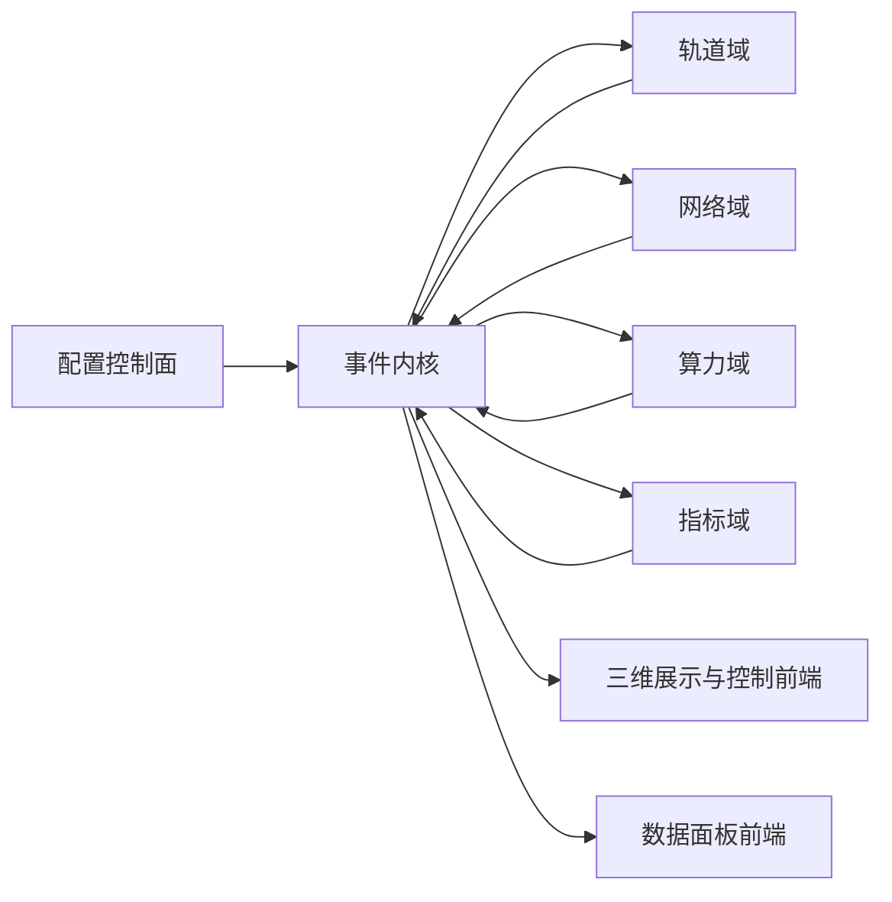
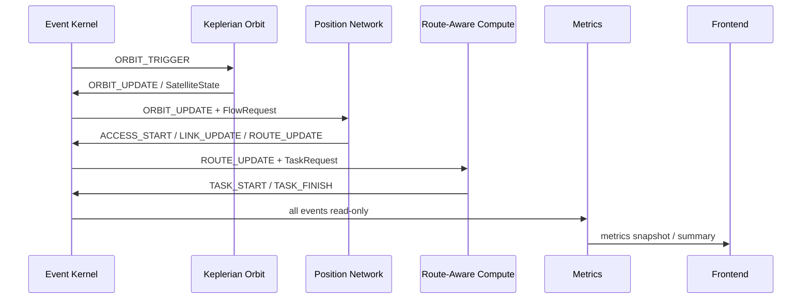

# LEO-Twin Full-System Architecture

## 目标

完整版 LEO-Twin 面向低轨卫星互联网通信-算力数字孪生仿真平台。系统目标从 MVP-0 的事件内核骨架扩展为可持续迭代的工程平台：

- 精细轨道状态驱动卫星拓扑变化。
- 网络仿真随轨道、链路、信道和算力状态变化而变化。
- 算力仿真受网络路由、传输时延、任务负载和节点资源共同影响。
- 前端拆分为三维展示/控制界面与数据面板界面。
- 所有用户可见界面使用中文。

## 不变边界

以下约束在完整版阶段仍然成立：

- Event Kernel 是唯一仿真时间权威。
- Orbit、Network、Compute、Metrics 之间禁止直接函数调用。
- 跨模块通信必须通过 `SimEvent` 和 `SimulationKernel.schedule_event()`。
- 配置驱动，禁止隐藏硬编码场景参数。
- 同一配置和同一 seed 必须得到相同事件序列与指标输出。
- 外部仿真器只能在明确的后续适配器任务中引入；当前阶段不依赖外部仿真器。

## 分层运行架构



## 轨道-网络-算力耦合

耦合关系通过事件表达：

| 耦合方向 | 事件/数据 | 说明 |
|---|---|---|
| 轨道 -> 网络 | `ORBIT_UPDATE` / `SatelliteState` | 卫星位置、速度、状态驱动覆盖、链路和拓扑变化。 |
| 网络 -> 算力 | `ROUTE_UPDATE` / `FlowState` | 路由可达性、时延和容量影响任务输入数据传输。 |
| 算力 -> 网络 | `TASK_START` / `TASK_FINISH` | 任务生命周期改变业务负载和后续流请求。 |
| 全域 -> 指标 | 所有事件只读 | 指标域采样、聚合并输出可视化数据。 |

## 网络分层架构

网络域采用可配置协议栈：

| 层级 | 职责 | 首批协议/配置 |
|---|---|---|
| 应用层 | 业务流、任务数据、请求模型 | 文件传输、遥测流、任务卸载流配置 |
| 传输层 | 端到端传输语义 | TCP、UDP 配置画像 |
| 网络层 | 路由、路径选择、可达性 | 静态路由、链路状态、距离向量、最短路径画像 |
| 数据链路层 | 空地/空空链路抽象、帧级资源画像 | 链路容量、链路可用性、接入窗口 |
| 物理层 | 频段、带宽、发射功率、天线参数 | 天线增益、波束宽度、指向模式 |
| 信道层 | 空地、空空、地面链路环境画像 | 载频、带宽、损耗模型名称 |

当前实现已经具备确定性协议画像运行时，协议仍然是流级和状态级抽象，不做 packet-level 仿真。

## 当前运行数据链路



## 已落地运行模块

| 模块 | 运行职责 | 约束 |
|---|---|---|
| `KeplerianOrbitEngine` | 根据配置产生确定性卫星位置、速度和 `ORBIT_UPDATE` | 不集成 SGP4，不依赖网络或算力实现 |
| `PositionDrivenNetworkEngine` | 根据轨道位置、用户位置和流请求产生接入、链路和路由事件 | 不做 packet-level 仿真，不直接调用 Orbit/Compute |
| `LinkBudgetCalculator` | 根据频率、带宽、天线和距离计算链路预算与容量画像 | 确定性闭式计算，不引入外部射频工具 |
| `RoutingRuntime` | 根据可用链路和路由画像输出确定性路径 | 当前是运行时策略抽象，不实现研究型路由优化 |
| `TransportRuntime` | 将 TCP/UDP 画像映射为流级时延和有效容量调整 | 不模拟真实协议栈报文 |
| `RouteAwareComputeEngine` | 根据路由状态和任务请求生成任务生命周期事件 | 当前不执行真实容器、GPU 或线程 |
| `ComputeSchedulingRuntime` | 提供 FIFO、最短作业优先、最早截止期优先的确定性排序 | 待接入主算力运行引擎 |
| `MetricsCollector` | 只读采集事件并生成指标摘要 | 禁止修改任何领域状态 |

## 层间影响规则

- 轨道影响网络：卫星位置改变覆盖、距离、链路预算和路由可达性。
- 网络影响算力：路由时延、容量和可达性决定任务启动和完成时间。
- 算力影响网络负载：任务生命周期可以生成后续业务流，但必须通过事件表达。
- 指标只观察不干预：任何 KPI、日志或前端摘要都不能反向修改仿真状态。

## 前端拆分

### 三维展示与控制前端

职责：

- 显示卫星、轨道、链路、覆盖、任务流动。
- 提供初始化、开始、暂停、停止、重置、速度和场景参数控制。
- 与控制面通过 WebSocket 指令交互。

### 数据面板前端

职责：

- 展示轨道、网络、算力、指标的可观测数据。
- 支持吞吐、时延、链路可用性、任务完成率、资源利用率等 KPI。
- 独立展示，避免三维渲染影响数据阅读。

## 模块依赖规则

```text
schema <- core
schema <- models/*
schema <- services/*
schema <- frontend protocol definitions

Orbit   -> core + schema
Network -> core + schema
Compute -> core + schema
Metrics -> core + schema
```

禁止：

- Orbit 导入 Network 或 Compute 实现。
- Network 导入 Orbit 或 Compute 实现。
- Compute 导入 Orbit 或 Network 实现。
- Metrics 修改任何领域状态。
- Frontend 直接修改内核状态；必须走控制面协议。
