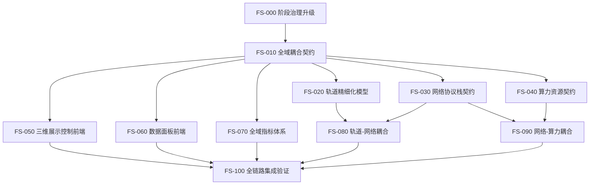

# LEO-Twin Full-System Roadmap

## 总体策略

完整版开发采用“契约冻结 -> 并行实现 -> 集成验证 -> 性能收敛”的持续迭代方式。每轮只处理一个明确任务，所有任务必须有测试、review 和 CI gate。

## 任务 DAG

## 12 步执行路线

1. 升级项目治理：区分 MVP-0 与完整版阶段。
2. 冻结完整版跨域数据契约和事件耦合边界。
3. 建立自动任务 DAG，使 Orbit / Network / Compute / Frontend 可并行推进。
4. 扩展轨道配置契约：轨道根数、姿态、星座、星历输入边界。
5. 扩展网络协议栈契约：应用层、传输层、网络层、数据链路层、物理层、信道层。
6. 扩展算力契约：节点资源、任务队列、服务链、卸载策略输入输出。
7. 实现轨道精细化第一版，并保持事件输出稳定。
8. 实现网络分层第一版，路由、链路和信道通过配置画像驱动。
9. 实现算力资源第一版，使任务生命周期受网络传输状态影响。
10. 拆分前端：三维控制界面与数据面板界面分别独立运行。
11. 增加全域指标：轨道、链路、路由、传输、任务、资源、UI 性能。
12. 做大规模稳定性收敛：万星级逻辑规模、长时间事件流、内存与指标下采样。

## 并行工作流

| 工作流 | 主要目录 | 首要任务 |
|---|---|---|
| Orbit | `src/leo_twin/models/orbit/` | 精细轨道状态生成与 `ORBIT_UPDATE` 稳定输出 |
| Network | `src/leo_twin/models/network/` | 分层协议栈、空地/空空链路、路由输出 |
| Compute | `src/leo_twin/models/compute/` | 任务队列、资源状态、任务生命周期 |
| Metrics | `src/leo_twin/services/metrics/` | KPI 聚合、下采样、数据面板输出 |
| Frontend 3D | `frontend/src/3d/` + `frontend/src/config_panel/` | 中文控制面、三维轨道/链路/覆盖展示 |
| Frontend Dashboard | `frontend/src/dashboard/` | 独立中文数据面板 |

## 验收原则

- 轨道、网络、算力必须互相影响，但只能通过事件影响。
- 网络层次必须清晰，协议和物理/信道参数先以配置画像表达。
- UI 必须中文化，按钮必须绑定实际控制行为。
- 每次迭代必须能回归现有测试。
- 大规模能力必须通过压测和稳定性指标证明，不能只靠声明。
