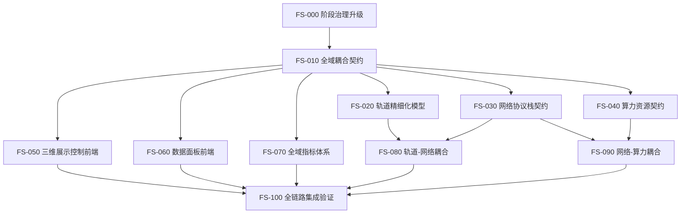

# LEO-Twin Full-System Roadmap

## 总体策略

完整版开发采用“契约冻结 -> 并行实现 -> 集成验证 -> 性能收敛”的持续迭代方式。每轮只处理一个明确任务，所有任务必须有测试、review 和 CI gate。

## 任务 DAG

## 12 步执行路线

1. 升级项目治理：区分 MVP-0 与完整版阶段。
2. 冻结完整版跨域数据契约和事件耦合边界。
3. 建立自动任务 DAG，使 Orbit / Network / Compute / Frontend 可并行推进。
4. 扩展轨道配置契约：轨道根数、姿态、星座、星历输入边界。
5. 扩展网络协议栈契约：应用层、传输层、网络层、数据链路层、物理层、信道层。
6. 扩展算力契约：节点资源、任务队列、服务链、卸载策略输入输出。
7. 实现轨道精细化第一版，并保持事件输出稳定。
8. 实现网络分层第一版，路由、链路和信道通过配置画像驱动。
9. 实现算力资源第一版，使任务生命周期受网络传输状态影响。
10. 拆分前端：三维控制界面与数据面板界面分别独立运行。
11. 增加全域指标：轨道、链路、路由、传输、任务、资源、UI 性能。
12. 做大规模稳定性收敛：万星级逻辑规模、长时间事件流、内存与指标下采样。

## 并行工作流

| 工作流 | 主要目录 | 首要任务 |
|---|---|---|
| Orbit | `src/leo_twin/models/orbit/` | 精细轨道状态生成与 `ORBIT_UPDATE` 稳定输出 |
| Network | `src/leo_twin/models/network/` | 分层协议栈、空地/空空链路、路由输出 |
| Compute | `src/leo_twin/models/compute/` | 任务队列、资源状态、任务生命周期 |
| Metrics | `src/leo_twin/services/metrics/` | KPI 聚合、下采样、数据面板输出 |
| Frontend 3D | `frontend/src/3d/` + `frontend/src/config_panel/` | 中文控制面、三维轨道/链路/覆盖展示 |
| Frontend Dashboard | `frontend/src/dashboard/` | 独立中文数据面板 |

## 当前实现状态

截至 2026-07-04，本路线图已经从“契约冻结”推进到“可运行全链路雏形”。下表用于约束后续开发，避免重复实现或越界重构。

| 领域 | 已具备能力 | 主要文件 | 下一步缺口 |
|---|---|---|---|
| 任务治理 | 完整版任务 DAG、阶段边界和自动化执行规则 | `docs/codex_skill.md`, `src/leo_twin/sees/full_system_tasks.py` | 将 DAG 状态接入可视化任务面板 |
| 轨道 | 确定性 Kepler 轨道状态生成，输出 `ORBIT_UPDATE` | `src/leo_twin/models/orbit/keplerian.py` | 星座批量配置、摄动画像、星历导入边界 |
| 场景配置 | 多卫星、多用户、算力节点、业务流和任务的确定性生成与 JSON 加载 | `src/leo_twin/services/scenario_builder.py`, `configs/generated_full_system_demo.json` | 将 UI 初始化配置直接映射到生成式场景配置 |
| 网络接入 | 基于卫星位置的空地接入、空空链路和多跳路由输入生成 | `src/leo_twin/models/network/position_engine.py` | 增量拓扑缓存、链路更新阈值、动态失败重路由 |
| 网络分层 | 应用层、传输层、网络层、数据链路层、物理层、信道层配置画像 | `src/leo_twin/models/network/stack.py` | 每层协议画像和事件输出的更细粒度映射 |
| 信道/物理 | 确定性链路预算、自由空间损耗、容量估算、按链路介质选择预算画像 | `src/leo_twin/models/network/channel.py` | 天气/遮挡画像、频率复用、波束切换 |
| 路由 | 静态、最短路径、链路状态、距离向量画像的确定性路径选择，已可消费空空链路 | `src/leo_twin/models/network/routing.py` | 动态链路代价、失败重路由、策略对比指标 |
| 传输 | TCP/UDP 流级传输画像，影响时延和有效容量 | `src/leo_twin/models/network/transport.py` | 拥塞窗口画像、丢包响应、业务流分类 |
| 算力 | 路由感知任务生命周期和 FIFO/SJF/EDF 调度策略接入 | `src/leo_twin/models/compute/network_aware.py`, `src/leo_twin/models/compute/scheduling.py` | 服务链、资源争用、任务失败/重试画像 |
| 指标 | 全链路事件采集、链路/路由 KPI 摘要、前端态势数据 | `src/leo_twin/services/metrics/collector.py` | 长时间运行分段输出、指标下采样策略 UI 化 |
| 前端 | 中文三维控制台 `/`、独立数据态势面板 `/dashboard`、链路与协议面板 | `frontend/src/` | 算力队列图表、信道预算图表、双屏部署配置 |
| 规模验证 | 千星级位置网络 smoke、10k 星/100k 用户场景构建 smoke 和确定性回归 | `tests/scale/` | 万星级端到端逻辑运行、百万事件稳定性预算 |

## 下一批可执行任务

1. 将前端“初始化”配置写入生成式场景 JSON，并由运行控制面加载。
2. 为 `PositionDrivenNetworkEngine` 增加链路更新阈值和增量拓扑缓存，减少高频轨道更新下的重复 `LINK_UPDATE`。
3. 增加动态路由代价画像：时延、容量、链路可用性、拥塞因子的可配置权重。
4. 补充信道预算数据面板：路径损耗、SNR、容量、链路介质和天线画像。
5. 增加算力队列图表：等待队列、调度策略、节点利用率、任务完成时间分布。
6. 建立万星级端到端逻辑运行配置，明确事件增长、内存窗口和指标采样上限。

## 验收原则

- 轨道、网络、算力必须互相影响，但只能通过事件影响。
- 网络层次必须清晰，协议和物理/信道参数先以配置画像表达。
- UI 必须中文化，按钮必须绑定实际控制行为。
- 每次迭代必须能回归现有测试。
- 大规模能力必须通过压测和稳定性指标证明，不能只靠声明。
