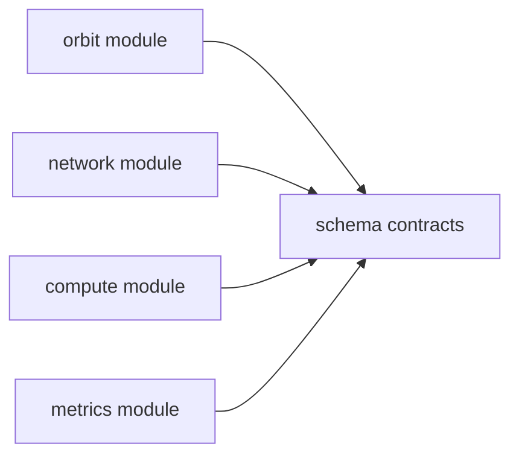

# Module Contract Freeze

This document freezes the cross-module contracts for parallel domain development. It defines interfaces, event contracts, data schemas, dependency rules, and file boundaries only.

No module implementation is introduced by this contract step.

## Contract Rule

All domain modules communicate only through:

- `SimEvent`
- `SimulationKernel.schedule_event()`

Direct function calls between Orbit, Network, Compute, and Metrics modules are forbidden.

## Dependency DAG



Allowed dependencies:

| Module | Allowed dependencies | Forbidden dependencies |
|---|---|---|
| Orbit | `core`, `schema` | Network, Compute, Metrics implementation |
| Network | `core`, `schema` | Orbit internals, Compute logic |
| Compute | `core`, `schema` | Orbit internals, Network internals |
| Metrics | `core`, `schema` | State mutation in any module |

The graph is a DAG. Domain modules are peers and must not import each other.

## Event Type Specification

| Event type | Producer | Consumers | Payload schema | Purpose |
|---|---|---|---|---|
| `ORBIT_TRIGGER` | Scenario | Orbit | `None` | Trigger orbit state publication |
| `ORBIT_UPDATE` | Orbit | Network, Metrics | `SatelliteState` | Publish satellite state |
| `ACCESS_START` | Network | Metrics | `LinkState` | Start satellite-ground access |
| `ACCESS_END` | Network | Metrics | `LinkState` | End satellite-ground access |
| `LINK_UPDATE` | Network | Metrics | `LinkState` | Publish link state |
| `FLOW_ARRIVAL` | Scenario | Network | `FlowRequest` | Request route decision |
| `FLOW_COMPLETE` | Network | Compute, Metrics | `FlowState` | Publish flow completion |
| `ROUTE_UPDATE` | Network | Compute, Metrics | `Route` | Publish route output |
| `TASK_ARRIVAL` | Scenario | Compute | `TaskRequest` | Request compute task handling |
| `TASK_START` | Compute | Metrics | `TaskState` | Publish task start |
| `TASK_FINISH` | Compute | Metrics | `TaskState` | Publish task finish |
| `COMPUTE_NODE_UPDATE` | Compute | Network, Metrics | `ComputeNodeState` | Publish compute capacity/load feedback |
| `METRIC_SAMPLE` | Metrics | Adapters | `MetricRecord` | Publish read-only metric sample |

## Orbit Module Contract

Formal interface: `OrbitModuleContract`

Inputs:

- `SimEvent` with `event_type == ORBIT_TRIGGER`

Outputs:

- `SimEvent` with `event_type == ORBIT_UPDATE`
- Payload: `SatelliteState`

Rules:

- Must not depend on Network.
- Must not depend on Compute.
- Must not call Network or Compute directly.
- Must publish all outputs through `kernel.schedule_event()`.

Future file structure:

```text
src/leo_twin/models/orbit/
  __init__.py
  engine.py
  contracts.py
```

## Network Module Contract

Formal interface: `NetworkModuleContract`

Inputs:

- `SimEvent` with `event_type == ORBIT_UPDATE`
- `SimEvent` with `event_type == FLOW_ARRIVAL`
- `SimEvent` with `event_type == COMPUTE_NODE_UPDATE`
- Payloads: `SatelliteState`, `FlowRequest`, `ComputeNodeState`

Outputs:

- `ACCESS_START`
- `ACCESS_END`
- `LINK_UPDATE`
- `ROUTE_UPDATE`
- Payloads: `LinkState`, `Route`

Required methods:

- `on_event(event, kernel)`
- `update_topology(sim_time)`
- `compute_access()`

Rules:

- Must not depend on Orbit internal implementation.
- Must not depend on Compute logic.
- Must output flow-level route decisions only.
- May consume compute node state events as capacity/load feedback.
- Must not implement packet-level simulation.

Future file structure:

```text
src/leo_twin/models/network/
  __init__.py
  engine.py
  contracts.py
```

## Compute Module Contract

Formal interface: `ComputeModuleContract`

Inputs:

- `SimEvent` with `event_type == TASK_ARRIVAL`
- `SimEvent` with `event_type == FLOW_COMPLETE`
- Payloads: `TaskRequest`, `FlowState`

Outputs:

- `TASK_START`
- `TASK_FINISH`
- `COMPUTE_NODE_UPDATE`
- Payloads: `TaskState`, `ComputeNodeState`

Rules:

- Must not depend on Orbit.
- Must not depend on Network internal logic.
- Must publish task lifecycle state through events.

Future file structure:

```text
src/leo_twin/models/compute/
  __init__.py
  engine.py
  contracts.py
```

## Metrics Module Contract

Formal interface: `MetricsModuleContract`

Inputs:

- All system events, read-only

Outputs:

- `MetricRecord`
- `metrics.csv`
- `summary.json`

Rules:

- Must not modify system state.
- Must not schedule domain state transitions.
- Must only observe events and emit metric samples.

Future file structure:

```text
src/leo_twin/services/metrics/
  __init__.py
  collector.py
  contracts.py
```

## Frozen Data Schemas

Defined in `src/leo_twin/schema/`:

- `EventType`
- `EventContract`
- `SatelliteState`
- `AccessAssociation`
- `FlowRequest`
- `FlowState`
- `LinkState`
- `Route`
- `ComputeNodeState`
- `TaskRequest`
- `TaskState`
- `MetricRecord`

These schemas are data contracts only. Algorithm and runtime behavior must be added only in future scoped implementation tasks.
